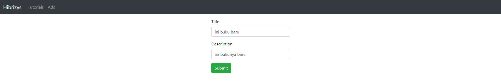
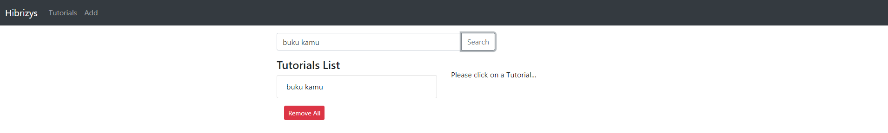

# Vue 3 example with Axios & Vue Router: Build CRUD App
Build a Vue.js 3 CRUD example to consume REST APIs, display and modify data using Axios and Vue Router.
- Each Tutorial has id, title, description, published status.
- We can create, retrieve, update, delete Tutorials.
- There is a Search bar for finding Tutorials by title.

## Overview

Home


Create



Replace


Update


Delete


Search


## Project setup
```
npm install
```

### Compiles and hot-reloads for development
```
npm run serve
```

### Compiles and minifies for production
```
npm run build
```

### Run your tests
```
npm run test
```

### Lints and fixes files
```
npm run lint
```

### Customize configuration
See [Configuration Reference](https://cli.vuejs.org/config/).
